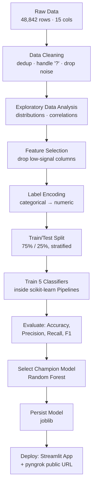

<div align="center">

# 💼 Employee Salary Classification

**Predicting whether an employee earns `>50K` or `≤50K` per year using machine learning, deployed as an interactive Streamlit web app.**

[](https://www.python.org/)
[](https://scikit-learn.org/)
[](https://xgboost.readthedocs.io/)
[](https://streamlit.io/)
[](#license)

</div>

---

## 📌 Overview

This project is an end-to-end machine learning pipeline that classifies an individual's income bracket (`≤50K` vs `>50K` per year) based on demographic and employment attributes, using the **UCI Adult Census Income** dataset.

The pipeline covers the full ML lifecycle: data cleaning → exploratory analysis → feature selection → multi-model benchmarking → champion model selection → deployment as a live, interactive web application.

> **Why this matters:** Income classification models like this are used in real-world applications such as workforce analytics, compensation benchmarking, socio-economic research, and policy analysis — wherever an organization needs to understand or estimate earning potential from demographic and employment signals.

<!-- 🖼️ IMAGE PLACEHOLDER: App hero screenshot -->
<!-- Replace this block with:  -->
<div align="center">
  
  <br/>
  <sub><i>Replace this image with a screenshot of the live app (single prediction view). Recommended size: 900×500px, PNG format, filename: <code>assets/app_demo.png</code></i></sub>
</div>

---

## 🗂️ Table of Contents

- [About the Dataset](#-about-the-dataset)
- [Project Pipeline](#-project-pipeline)
- [Data Cleaning](#-data-cleaning)
- [Feature Selection](#-feature-selection)
- [Models Trained & Why](#-models-trained--why)
- [Why Not Just Accuracy?](#-why-not-just-accuracy)
- [Results](#-results)
- [Champion Model](#-champion-model)
- [App Demo](#-app-demo)
- [Tech Stack](#️-tech-stack)
- [Project Structure](#-repository-structure)
- [Getting Started](#-getting-started)
- [Future Improvements](#-future-improvements)
- [Author](#-author)

---

## 📊 About the Dataset

This project uses the **[UCI Adult Census Income dataset](https://archive.ics.uci.edu/dataset/2/adult)**, a well-known benchmark dataset originally extracted from 1994 U.S. Census Bureau data.

| | |
|---|---|
| **Rows** | 48,842 |
| **Columns** | 15 (14 features + 1 target) |
| **Target variable** | `income` → `<=50K` or `>50K` |
| **Class balance** | ~76% `≤50K`, ~24% `>50K` (imbalanced) |
| **Feature types** | 6 numerical, 8 categorical |

**Original features included:**
`age`, `workclass`, `fnlwgt`, `education`, `educational-num`, `marital-status`, `occupation`, `relationship`, `race`, `gender`, `capital-gain`, `capital-loss`, `hours-per-week`, `native-country`

The dataset is intentionally messy and realistic — it contains duplicate rows, missing values encoded as `"?"`, and several categorical features with low predictive signal — making it a strong candidate for demonstrating a complete, defensible data cleaning and feature selection process.

---

## 🔄 Project Pipeline



---

## 🧹 Data Cleaning

Real-world data is never clean out of the box. Here's exactly what was done and why:

| Step | Action | Reason |
|---|---|---|
| **Duplicate removal** | Dropped 52 exact duplicate rows | Duplicate records bias the model toward over-represented patterns |
| **Missing value handling** | Replaced `"?"` placeholders in `workclass` and `occupation` with `"Others"` | Preserves row count instead of discarding ~3% of data; avoids silently treating `"?"` as a meaningful category |
| **Outlier-class removal** | Dropped rows where `workclass` was `Never-worked` or `Without-pay` | These individuals are, by definition, outside the labor income distribution the model is meant to predict |
| **Redundant column removal** | Dropped `education` (kept `educational-num`) | `education` and `educational-num` are the same information in text vs. ordinal-numeric form — keeping both adds redundant noise |

---

## 🎯 Feature Selection

After correlation analysis, the following low-signal or ethically problematic columns were **dropped**:

```
workclass, fnlwgt, occupation, race, native-country
```

**Why these specifically:**

- **`fnlwgt`** — a census sampling weight, not a real-world predictive signal about the individual.
- **`race`, `native-country`** — beyond showing low correlation with income, including these raises fairness and legal concerns; a salary classifier should not be trained to use protected demographic attributes as direct predictors.
- **`workclass`, `occupation`** — retained low marginal correlation with the target relative to the features below, given the available encoding scheme.

**Final 8 features used for prediction:**

| Feature | Type | Description |
|---|---|---|
| `age` | Numeric | Age of the individual |
| `educational-num` | Ordinal | Education level, encoded 1–16 |
| `marital-status` | Categorical (encoded) | Marital status |
| `relationship` | Categorical (encoded) | Relationship role within household |
| `gender` | Binary (encoded) | Male / Female |
| `capital-gain` | Numeric | Income from capital gains |
| `capital-loss` | Numeric | Losses from capital investments |
| `hours-per-week` | Numeric | Average weekly working hours |

**Target:** `income` (`≤50K` / `>50K`)

---

## 🤖 Models Trained & Why

Rather than committing to a single algorithm, **five classifiers spanning different learning paradigms** were trained and benchmarked on an identical train/test split, so the comparison is fair and reproducible:

| Model | Why it was included |
|---|---|
| **Logistic Regression** | Fast, interpretable linear baseline — establishes a performance floor |
| **Decision Tree** | Captures non-linear feature interactions; easy to interpret |
| **Random Forest** | Ensemble of trees — reduces overfitting and variance versus a single tree |
| **K-Nearest Neighbors (KNN)** | Distance-based, non-parametric approach — a useful contrast to tree-based and linear models |
| **XGBoost** | Gradient-boosted trees — typically among the strongest performers on structured/tabular data |

All models (except XGBoost, which is scale-invariant) were trained inside a **scikit-learn `Pipeline`** with `StandardScaler`, ensuring the scaler is fit only on training data — preventing data leakage from the test set into preprocessing.

```python
pipe = Pipeline([
    ('scaler', StandardScaler()),
    ('model', model)
])
```

---

## ⚖️ Why Not Just Accuracy?

This dataset is **imbalanced** — roughly 76% of individuals earn `≤50K` and only 24% earn `>50K`. That means a naive model that *always* predicts `≤50K` would still score **~76% accuracy** without learning anything useful.

This is exactly why this project evaluates every model using **precision, recall, and F1-score for both classes**, not accuracy alone. Specifically:

- **Recall on the `>50K` class** tells us how many actual high-earners the model successfully identifies — critical if the use case is identifying candidates for a raise, promotion, or targeted outreach.
- **Precision on the `>50K` class** tells us how many of the model's "high earner" predictions are actually correct — critical if false positives are costly.
- **F1-score** balances both, and is the metric used here to make the champion model selection meaningful rather than misleading.

---

## 📈 Results

Full classification report for every model (test set, 12,190 samples):

| Model | Accuracy | Precision (`>50K`) | Recall (`>50K`) | F1-score (`>50K`) |
|---|---|---|---|---|
| Logistic Regression | 0.8183 | 0.69 | 0.44 | 0.53 |
| Decision Tree | 0.8280 | 0.66 | 0.57 | 0.61 |
| **Random Forest** | **0.8433** | **0.70** | **0.60** | **0.65** |
| KNN | 0.8322 | 0.67 | 0.59 | 0.63 |
| XGBoost | 0.8322 | 0.67 | 0.59 | 0.63 |

<!-- 🖼️ IMAGE: This chart is regenerated from the exact accuracy values above -->
<div align="center">
  
  <br/>
  <sub><i>Model accuracy comparison — Random Forest leads on accuracy, precision, recall, and F1 simultaneously.</i></sub>
</div>

**Key takeaway:** Random Forest wins not just on accuracy, but on **every metric for the minority class** — meaning it generalizes best across *both* income brackets, not just the majority class. This is the actual justification for selecting it as champion, rather than accuracy alone.

---

## 🏆 Champion Model

**Random Forest Classifier** was selected as the production model.

**Why Random Forest outperforms the alternatives here:**
- As a **bagging ensemble** of many decision trees trained on random feature/data subsets, it reduces the variance and overfitting risk of a single Decision Tree.
- It handles the dataset's **class imbalance and feature noise** more robustly than a single linear boundary (Logistic Regression) or distance metric (KNN).
- It natively supports feature importance extraction, useful for future interpretability work.

The trained model is serialized using **`joblib`** (preferred over `pickle` for scikit-learn's numpy-backed objects) and loaded directly into the deployed Streamlit application.

```python
import joblib
joblib.dump(best_model, "Champion_model.pkl")
```

---

## 🌐 App Demo

The trained model is deployed as an interactive **Streamlit** web application with two modes:

### 1️⃣ Single Prediction
Users fill out a form (age, education, marital status, relationship, gender, capital gain/loss, hours per week) and get an instant prediction.

<!-- 🖼️ IMAGE PLACEHOLDER: Single prediction form screenshot -->
<!-- Replace with:  -->
<div align="center">
  
  <br/>
  <sub><i>Replace with a screenshot of the single-prediction form + result. Recommended size: 800×600px, filename: <code>assets/single_prediction.png</code></i></sub>
</div>

### 2️⃣ Batch Prediction (CSV Upload)
Users upload a CSV of multiple employee records and receive predictions for the entire batch, downloadable as a new CSV.

<!-- 🖼️ IMAGE PLACEHOLDER: Batch prediction screenshot -->
<!-- Replace with:  -->
<div align="center">
  
  <br/>
  <sub><i>Replace with a screenshot of the batch CSV upload + results table. Recommended size: 800×600px, filename: <code>assets/batch_prediction.png</code></i></sub>
</div>

**Deployment mechanism:** The app runs locally via `streamlit run app.py`, and is exposed to a public URL using **pyngrok**, which tunnels the local Streamlit server (port 8501) to a publicly accessible HTTPS link — useful for quick demos without provisioning cloud infrastructure.

---

## 🛠️ Tech Stack

| Category | Tools |
|---|---|
| **Language** | Python 3.10 |
| **Data handling** | Pandas, NumPy |
| **Visualization** | Matplotlib, Seaborn |
| **Modeling** | scikit-learn (Logistic Regression, Decision Tree, Random Forest, KNN), XGBoost |
| **Preprocessing** | scikit-learn `Pipeline`, `StandardScaler`, `LabelEncoder` |
| **Model persistence** | joblib |
| **Web app** | Streamlit |
| **Public deployment tunnel** | pyngrok |

---

## 📂 Repository Structure

```
employee-salary-prediction/
│
├── app.py                                       # Streamlit application (single + batch prediction)
├── employee_salary_prediction_updated.ipynb     # Full notebook: cleaning → EDA → modeling → evaluation
├── Champion_model.pkl                           # Serialized Random Forest model (joblib)
├── requirements.txt                             # Project dependencies
├── README.md                                    # Project documentation (this file)
├── assets/                                      # Images used in this README
│   ├── model_comparison.png
│   ├── app_demo.png                             # ⬅ add your screenshot here
│   ├── single_prediction.png                    # ⬅ add your screenshot here
│   └── batch_prediction.png                     # ⬅ add your screenshot here
└── data/
    └── adult 3.csv                              # UCI Adult Census dataset
```

---

## 🚀 Getting Started

**1. Clone the repository**
```bash
git clone https://github.com/your-username/employee-salary-prediction.git
cd employee-salary-prediction
```

**2. Create and activate a virtual environment**
```bash
python -m venv venv
source venv/bin/activate      # macOS/Linux
venv\Scripts\activate         # Windows
```

**3. Install dependencies**
```bash
pip install -r requirements.txt
```

**4. Run the Streamlit app**
```bash
streamlit run app.py
```

The app will open at `http://localhost:8501`.

---

## 🔮 Future Improvements

- [ ] Replace `pickle`/`joblib` with **ONNX** export to decouple the model from the exact scikit-learn version it was trained on
- [ ] Add **SHAP-based feature importance** to the app for per-prediction explainability
- [ ] Address **class imbalance** explicitly via SMOTE or class-weighted loss, rather than relying solely on F1-score for model selection
- [ ] Add **data/concept drift monitoring**, since the underlying census data is from 1994 and income-education relationships have shifted significantly since then
- [ ] Replace pyngrok with a permanent deployment (Streamlit Community Cloud, AWS, or a containerized FastAPI + Docker service) for production use
- [ ] Add automated tests for the preprocessing and inference pipeline

---

## 👨‍💻 Author

**Uttam Singh Chaudhary**

📧 Connect on [LinkedIn](https://www.linkedin.com/in/uttam-singh-chaudhary-98408214b)

---

<div align="center">
<sub>Built as part of an AICTE-affiliated internship project · UCI Adult Census Income dataset</sub>
</div>
